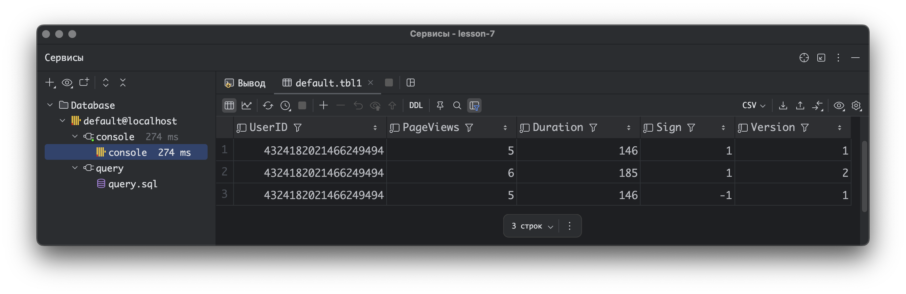
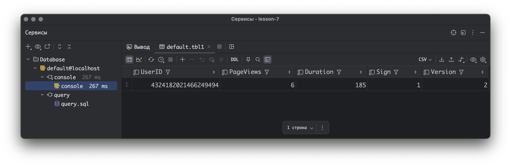
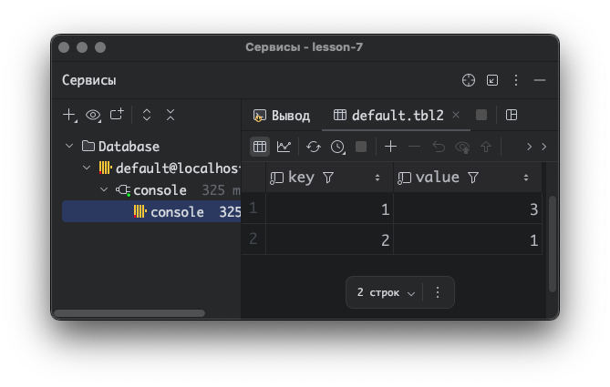
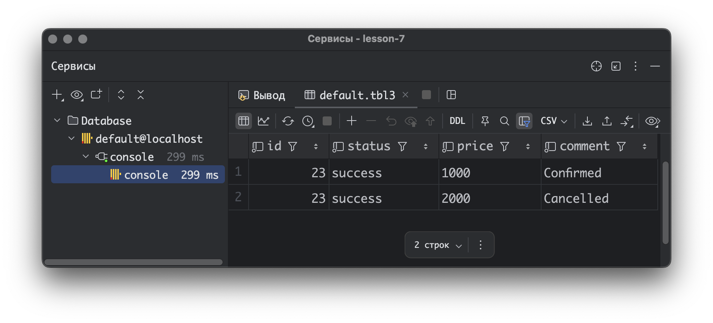
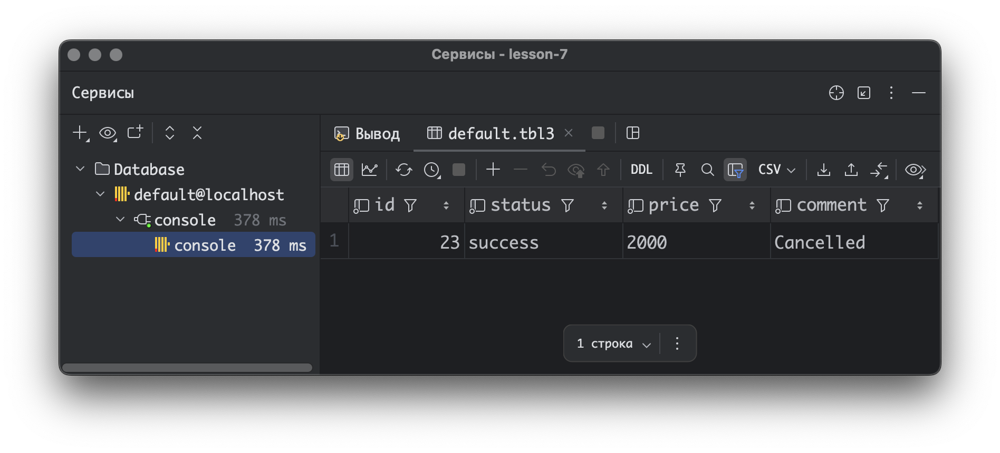
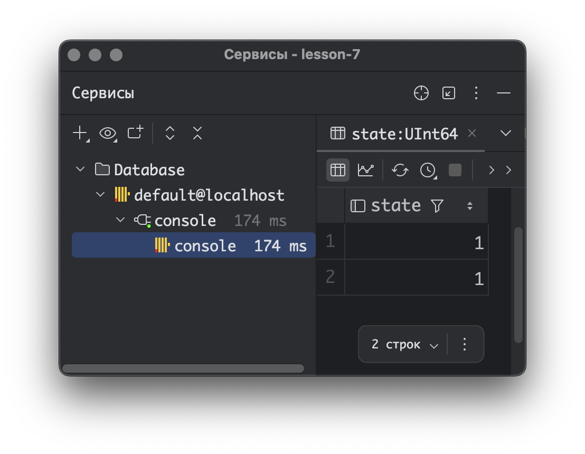
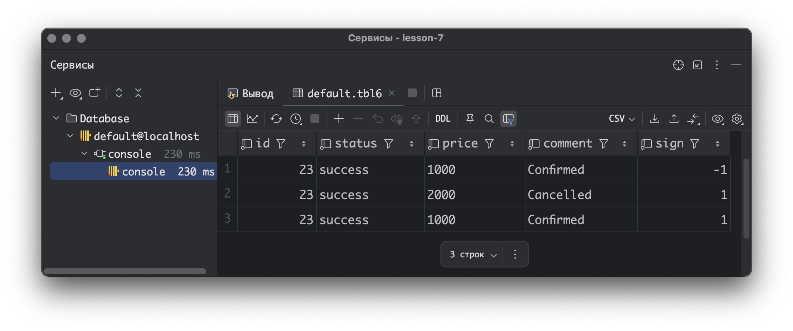
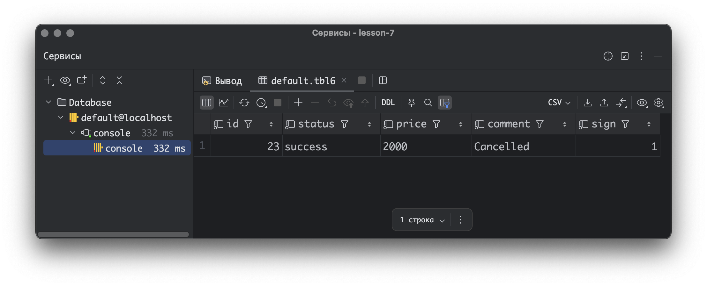

Задание выполнено на ClickHouse v24.12.3

Для более удобной работы использовал DataGrid, весь sql сохранен в файл
[query.sql](query.sql)

#### Пример 1

Движок `VersionedCollapsingMergeTree` предназначен для управления "сворачиванием" (объединением) строк с изменяющимися данными.
Он использует две колонки:
- `Sign` (тип `Int8`): указывает, является ли строка добавлением (`1`) или удалением (`-1`).
- `Version` (тип `UInt8`): определяет порядок обработки изменений (чем выше версия, тем приоритетнее строка). 

`ORDER BY UserID` - строки с одинаковым `UserID` объединяются.
`Sign` и `Version` - управляют логикой сворачивания.

``` SQL
CREATE TABLE tbl1
(
    UserID    UInt64,
    PageViews UInt8,
    Duration  UInt8,
    Sign      Int8,
    Version   UInt8
)
    ENGINE = VersionedCollapsingMergeTree(Sign, Version)
        ORDER BY UserID;

INSERT INTO tbl1
VALUES (4324182021466249494, 5, 146, -1, 1);
INSERT INTO tbl1
VALUES (4324182021466249494, 5, 146, 1, 1),
       (4324182021466249494, 6, 185, 1, 2);
```

``` SQL 
SELECT * FROM tbl1;
```




``` SQL 
SELECT * FROM tbl1 FINAL;
```



#### Пример 2

Как работает `SummingMergeTree(value)`:
 - Ключ объединения: `ORDER BY key` (все строки с одинаковым `key` объединяются в одну).
 - Суммируемая колонка: `value` (указана в движке: `SummingMergeTree(value))`.

Поведение:
 - При объединении значения `value` складываются.
 - Колонки, не указанные в SummingMergeTree(...), сохраняют значение из последней вставленной строки (в данном примере других колонок нет).

``` SQL
CREATE TABLE tbl2
(
    key   UInt32,
    value UInt32
)
    ENGINE = SummingMergeTree(value)
        ORDER BY key;

INSERT INTO tbl2
Values (1, 1),
       (1, 2),
       (2, 1);
```

``` SQL 
SELECT *
FROM tbl2;
```



#### Пример 3

``` SQL
CREATE TABLE tbl3
(
    `id` Int32,
    `status` String,
    `price` String,
    `comment` String
)
    ENGINE = ReplacingMergeTree
    PRIMARY KEY (id)
    ORDER BY (id, status);

INSERT INTO tbl3 VALUES (23, 'success', '1000', 'Confirmed');
INSERT INTO tbl3 VALUES (23, 'success', '2000', 'Cancelled');
```

``` SQL 
SELECT * from tbl3 WHERE id=23;
```

Если фоновый процесс слияния данных еще не завершился, мы увидим обе строки

Почему так происходит: `ReplacingMergeTree` объединяет дубликаты асинхронно. Без `FINAL` запрос возвращает "сырые" данные, которые еще не обработаны фоновым процессом.



``` SQL 
SELECT * from tbl3 FINAL WHERE id=23;
```

Произойдет принудительное объединение данных, и останется только последняя строка.

Почему так происходит:
 - `PRIMARY KEY (id)` задает ключ для определения дубликатов. Строки с одинаковыми `id` считаются дубликатами.
 - `ReplacingMergeTree` оставляет последнюю вставленную строку (по умолчанию, если не указана версионная колонка).
 - Модификатор `FINAL` активирует объединение данных.



#### Пример 4

Движок: `MergeTree` - стандартный движок с поддержкой партиционирования и сортировки.

``` SQL
CREATE TABLE tbl4
(   CounterID UInt8,
    StartDate Date,
    UserID UInt64
) ENGINE = MergeTree
PARTITION BY toYYYYMM(StartDate) 
ORDER BY (CounterID, StartDate);

INSERT INTO tbl4 VALUES(0, '2019-11-11', 1);
INSERT INTO tbl4 VALUES(1, '2019-11-12', 1);
```
Движок: `AggregatingMergeTree` - предназначен для хранения агрегированных данных. Поддерживает автоматическое объединение агрегатов при слиянии партиций.
На это указывает результат запроса и использование `AggregateFunction(uniq, UInt64)` агрегирующей функции.

``` SQL
CREATE TABLE tbl5
(   CounterID UInt8,
    StartDate Date,
    UserID AggregateFunction(uniq, UInt64)
) ENGINE = AggregatingMergeTree
PARTITION BY toYYYYMM(StartDate) 
ORDER BY (CounterID, StartDate);

INSERT INTO tbl5
select CounterID, StartDate, uniqState(UserID)
from tbl4
group by CounterID, StartDate;
```

Проблема: Значение 1 несовместимо с типом `AggregateFunction`. Нужно использовать `uniqState(1)`.

``` SQL
INSERT INTO tbl5 VALUES (1,'2019-11-12',1);
```

Чтобы исправить ошибку можно выполнить запрос так

``` SQL
INSERT INTO tbl5
SELECT
    1 AS CounterID,
    '2019-11-12' AS StartDate,
    uniqState(toUInt64(1)) AS UserID
FROM (SELECT 1);
```

Функция `uniqMerge`: Объединяет промежуточные состояния (`uniqState`) и возвращает итоговое количество уникальных значений.

``` SQL 
SELECT uniqMerge(UserID) AS state 
FROM tbl5 
GROUP BY CounterID, StartDate;
```




#### Пример 5

В конкретном примере первая пара строк (`sign=1` и `sign=-1`) аннулируют друг друга.
Третья строка (`sign=1`) имеет новый `price='2000'` и `comment='Cancelled'`.
Так как предыдущие строки с тем же ключом были аннулированы, эта строка остается.

``` SQL
CREATE TABLE tbl6
(
    `id` Int32,
    `status` String,
    `price` String,
    `comment` String,
    `sign` Int8
)
ENGINE = CollapsingMergeTree(sign)
PRIMARY KEY (id)
ORDER BY (id, status);

INSERT INTO tbl6 VALUES (23, 'success', '1000', 'Confirmed', 1);
INSERT INTO tbl6 VALUES (23, 'success', '1000', 'Confirmed', -1), 
                        (23, 'success', '2000', 'Cancelled', 1);
```

``` SQL 
SELECT * FROM tbl6;
```



``` SQL 
SELECT * FROM tbl6 FINAL;
```

